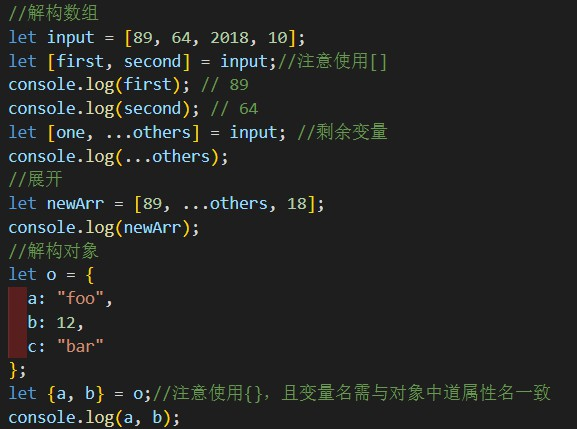
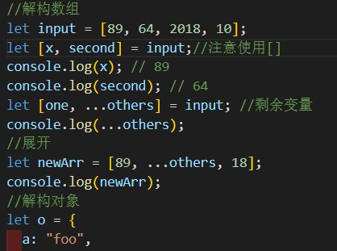

我的个人感觉，就是可以在转译为纯JavaScript,前把该报的错报掉。也就就是说比JavaScript更严谨。
# 声明变量

    用let或者const,const声明的话是常量不可以改变的常量；
    声明变量类型，在变量名后面加":"，然后注明类型名，像这样：

# 解构

    感觉有点像切片，但又不是；

    把first改为了x,这说明这个解构其实就是给对应数组元素赋予了一个变量名
就是那个"...others"有点特别。

以上是数组。

    当是对象时，就用{}，里面填你需要的属性名，就可以取出来了。

# 函数

    函数定义:
        function 函数名(参数名=value,参数名:参数类型,参数名?:参数类型)：返回值类型{
            return xxx;
        }
        返回值可以不写，我试过；写上可读性更强。
        参数名后有问号的是参数变量，也就是可有可无，必须写在最后。
        参数名后是等号的是默认参数，位置哪都行。

        匿名函数定义：
        let myAdd = function(x: number, y: number): number { return x + y; };

        function greeting(firstName: string, ...restName: string[]) {
        return `Hello ${firstName} ${restName.join(' ')}!`;
        }
        ...restName:string[]
        用来处理你不知道参数个数的情况。

# 箭头函数

我的理解就是函数的一种简写形式 ：
 函数名=（）=>{}

 （）放参数，{}放函数体;

 # 类

    类的定义：
        class 类名{
            属性名:类型;

            constructor(参数名：参数类型){//构造函数，一般对对象进行初始化。

            }
        }

    类的使用：
        let 对象名=new 类名（参数名：参数类型）；//调用构造函数进行初始化

    类的属性和函数的访问权限：
        类中的属性和函数都有访问权限，默认为public即全局可访问，其次为protected即可在类的内部和其子类的内部可访问，最后为private，只能在该类内部可访问。

        私有属性或函数以下划线"_"打头。

    存取器：getter,setter用来操作私有属性。

    静态属性：
    属于类的属性，可以通过类名直接调用。

    继承：
    可以通过extends关键字继承其它类，从而成为其子类.

# Module
    对于大型的项目，我们需要使用模块进行管理。每个 .ts 文件就是一个模块，通过 export 来对外部模块暴露元素，通过 import 来引入模块。